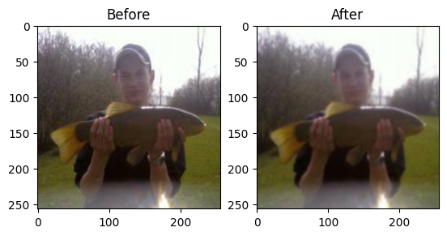
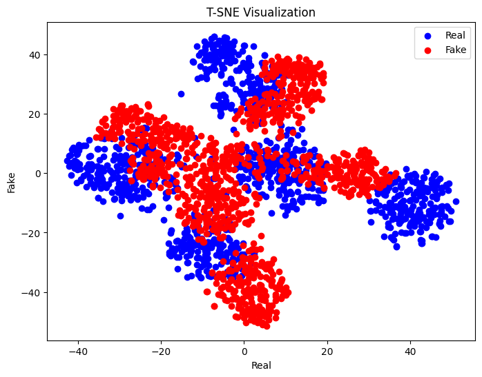

# DeepFake-Image Classification
Implemented a Deep Learning Model to detect Real and fake Images.
# Implementation of Paper-4
I have implemented deepfake image classification using Progan dataset. It involves reading and preprocessing images from a ProGAN dataset, extracting features using the CLIP (Contrastive Language-Image Pre-training) model, visualizing feature embeddings, and implementing image classification using nearest neighbor and linear classification approaches.

## Table of Contents

- [Data Reading](#data-reading)
- [Preprocessing](#preprocessing)
- [Feature Extraction](#feature-extraction)
- [T-SNE Plot](#tsne-plot)
- [Nearest Neighbor Approach](#nearest-neighbor-approach)
- [Linear Classification Approach](#linear-classification-approach)
- [Accuracy](#accuracy)
## Data Reading
- Reading data from **ProGan** (Real and Fake Images) for **Training Phase**
- It iterate over each file and **Reads** the image using cv2.imread()
- It checks if the image is in **RGB Format** and appends the image if it satisfies this criterion
- Now we **Resize** the image into **(224,224,3)** dimensions

## Preprocessing
- 1. **JPEG Compression** : It converts the format of image to .jpg with 80% 
- 2. **Gaussian Blur** :  It applies a gaussian blur filter with kernel size=(5,5) and std dev=0 to half of the images using np.random.rand()<0.5

Effect of preprocessing on some random image

## Feature Extraction

Features from the images are extracted using the CLIP (Contrastive Language-Image Pre-training) model. The features are then saved for further analysis and classification tasks.

## T-SNE Plot

## Nearest Neighbor Approach

**Funcion**:
- It finds the nearest neighbor to a given test feature vector among a set of feature vectors using cosine similarity.

**Parameters**:
- test: The test feature vector for which the nearest neighbor is to be found.
- features: A 2D array containing feature vectors among which to find the nearest neighbor.

**Returns**:
- nn_sim: The cosine similarity between the test feature vector and its nearest neighbor.

**Testing Phase**
- After training on ProGan now I am testing on **Glide-100** and **Laion**
- The **test.pt** file is loaded and converted to a NumPy array (which contains Images from **Glide** and **Laion**)
- A loop iterates over each feature vector in features_test.
    - For each feature vector, the nearest neighbors are found in both the real and fake feature sets using the find_nn() function.
    - That class which has less cosine similarity which means it is more closer to test image is assigned to the test image 

## Linear Classification Approach

For **Linear Classification**, I am training a neural network using TensorFlow's Keras API **(FCNN network)**

1. **Data Preparation**: `features_real` and `features_fake` are concatenated into `X_train`and corresponding labels `Y_train` are defined. Then both are converted into numpy arrays

2. **Hyperparameters**: 
    - **Batch Size:** 30 (as instructed in the research paper)
    - **Epochs:** 7 (The model acheives a training accuracy of 1 so trained on less no of epochs)

3. **Model Structure**: It consists of two fully connected layers: 
    - First layer has 768 units and uses the ReLU activation function.
    - Output layer has 1 unit with a sigmoid activation function, for binary classification problems.

4. **Model Compilation**: The model is compiled using the Adam optimizer and binary crossentropy loss function. 
    - Used **Adam** as optimizer
    - Used **Binary crossentropy loss** as Loss Function

## Accuracy
- I had trained on Progan image set
1. **Nearest Neighbor Method**
 
| Dataset              |    Accuracy   |     SOTA      |
| -------------------- | ------------- | ------------- |
| Glide-100 and Laion  |    75.3%      |     87%       |

2. **Linear Classification**

| Dataset              |    Accuracy   |     SOTA      |
| -------------------- | ------------- | ------------- |
| CycleGan             |    97.3%      |     98.5%     |
| Dalle and Laion      |    92.9%      |     86.78%    |
| Glide-100 and Laion  |    86.9%      |     79%       |

# Implementation of Paper-2

If the detected image is Fake, then it detects the source of the Fake image (General Adversive Networks (GAN) or Diffusion Models (DM)).

The model takes in the weights of a pretrained RESNET-50 model and then it fine-tunes those weights for our task by freezing the starting layers.

Level-1: Achieves 87% accuracy to detect real and Fake Images (It was trained on Dalle Fake images and Laiom Real images and tested on Glide fake images).

Level-2: The model trained for detecting the source of Fake image achieves a Testing Accuracy of 93%.
## Dataset Links:

Diffusion Models: [Link](https://drive.google.com/file/d/1FXlGIRh_Ud3cScMgSVDbEWmPDmjcrm1t/view)

GAN's: [Link](https://drive.google.com/file/d/1z_fD3UKgWQyOTZIBbYSaQ-hz4AzUrLC1/view)

You can load the .pt files from the `Data` Folder 
The model created for Linear Classification in Paper4 is present with named `model_lc.h5`
